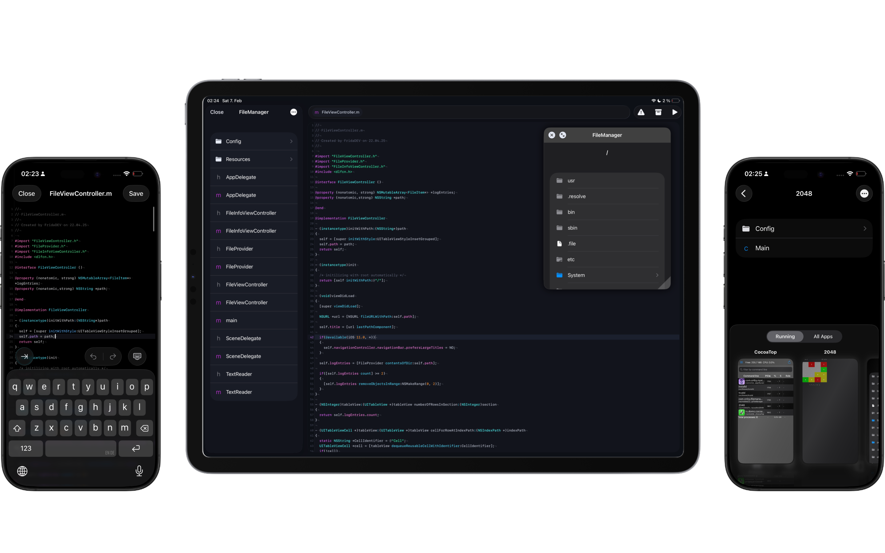

  <h1><b>Nyxian</b></h1>
  
<i>IDE to develop native code iOS apps and tools on unjailbroken iOS</i>

<h6 align="center">
  
  
</h6>

  

## What is it?
Nyxian is an iOS app that empowers developers with a full toolchain they can use while even being offline for iOS development on iPhone. It supports C, ObjC, C++ and ObjC++ with Swift support announced for 0.9.x. It’s a powerful Xcode alternative that made the impossible possible, a fully On-device iOS IDE that doesn’t even need a cloud. It supports officially iOS 18 all the way up to the latest iOS version. You can compile and run iOS apps on the go without any problems, using the entire iOS 26.1 SDK.

## Installation

### Jailed
Jailed is the main version of Nyxian. You need a free or paid apple developer account, which you have to use to sign and install Nyxian and in Nyxian you have to import the same developer certificate.
**Do not use LiveContainer** to use Nyxian, install Nyxian seperately.

##### Requirements

- iOS/iPadOS 16+
- AltStore 2.0+ / SideStore 0.6.0+

##### Download:

### Jailbroken
A guide is coming here soon, but for now just look at the releases.

## Todo
- [x] Code execution using NSExtension
- [x] Syscall Handling 
- [x] Sub processsing
- [x] Compiling code
- [x] Linking object files
- [x] Signing executables
- [x] Native iOS app development
- [x] Native iOS utility development
- [ ] Native iOS tweak development
- [ ] React Native development (IDK WHY??)
- [ ] Web development (IDK WHY??)
- [ ] Python development (IDK WHY??)
- [ ] Lua development (IDK WHY??)
